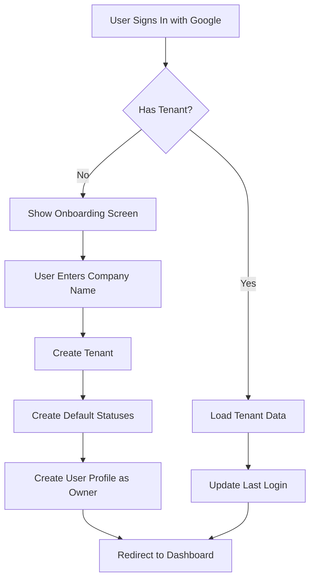

# T4U Architecture Documentation

## Overview

T4U (Test For You) is a multi-tenant test automation platform built with Next.js, Firebase, and TypeScript. The system supports both web and mobile end-to-end automated testing with a hierarchical data structure and AI-powered test execution.

---

## Architecture Principles

### Multi-Tenancy
- **Every collection** includes a `tenantId` field
- Users can only access data belonging to their tenant
- Firestore security rules enforce tenant isolation
- Each tenant is completely isolated from others

### Data Hierarchy
```
Tenant
  └── Projects
      ├── Features
      │   └── Stories
      │       └── Test Cases
      │           └── Test Case Steps
      ├── Test Plans
      │   └── Test Cases (references)
      └── Runs
          └── Test Case Results
```

---

## Core Entities

### 1. Tenant
**Collection:** `tenants`

The top-level organization entity representing a company or team.

```typescript
interface Tenant {
  id: string;
  name: string;              // Company name
  ownerId: string;           // User who created the tenant
  isActive: boolean;         // Soft delete flag
  createdAt: string;
  updatedAt: string;
}
```

**Key Points:**
- Created on first user sign-up
- One user can only belong to one tenant
- Owner has full administrative access
- Default test case statuses are created automatically

---

### 2. User
**Collection:** `users`

User profile with tenant association and role-based access.

```typescript
interface T4UUser {
  id: string;                // Firebase Auth UID
  email: string;
  displayName: string;
  photoURL?: string;
  tenantId: string;          // Associated tenant
  role: "owner" | "admin" | "member";
  createdAt: string;
  updatedAt: string;
  lastLoginAt?: string;
}
```

**Roles:**
- **Owner**: Created the tenant, full access
- **Admin**: Can manage all resources
- **Member**: Can view and create resources

---

### 3. Project
**Collection:** `projects`

Logical container for organizing test automation work.

```typescript
interface Project {
  id: string;
  tenantId: string;          // Multi-tenant isolation
  name: string;
  description?: string;
  createdAt: string;
  updatedAt: string;
  createdBy: string;         // User ID
}
```

**Examples:**
- "E-commerce Website"
- "Mobile App v2.0"
- "Admin Dashboard"

---

### 4. Feature
**Collection:** `features`

Represents a specific area or module within a project.

```typescript
interface Feature {
  id: string;
  tenantId: string;          // Multi-tenant isolation
  projectId: string;         // Parent project
  name: string;
  description?: string;
  createdAt: string;
  updatedAt: string;
  createdBy: string;         // User ID
}
```

**Examples:**
- "Login Process"
- "Home Page"
- "Finance Module"
- "Shopping Cart"
- "User Profile Management"

---

### 5. Story
**Collection:** `stories`

Logical grouping of related test cases within a feature.

```typescript
interface Story {
  id: string;
  tenantId: string;          // Multi-tenant isolation
  featureId: string;         // Parent feature
  name: string;
  description?: string;
  createdAt: string;
  updatedAt: string;
  createdBy: string;         // User ID
}
```

**Examples:**
- "User can login with valid credentials"
- "Password reset flow"
- "Social media login"

---

### 6. Test Case
**Collection:** `test_cases`

The core entity representing an individual test scenario.

```typescript
interface TestCase {
  id: string;
  tenantId: string;          // Multi-tenant isolation
  projectId: string;         // For easier lookups
  storyId: string;           // Parent story
  name: string;
  description?: string;
  scenario: string | TestCaseStep[];  // Flexible format
  statusId: string;          // Reference to TestCaseStatus
  createdAt: string;
  updatedAt: string;
  createdBy: string;         // User ID
  proven_steps?: ProvenStep[];  // AI-validated automation steps
  proven_steps_count?: number;  // Cached count
}
```

**Scenario Field:**
- Can be simple **text** (free-form description)
- Or structured **list of steps** (TestCaseStep[])

**Example (Text Scenario):**
```json
{
  "name": "Login with valid credentials",
  "scenario": "1. Navigate to login page\n2. Enter username\n3. Enter password\n4. Click login\n5. Verify dashboard loads"
}
```

**Example (Structured Scenario):**
```json
{
  "name": "Login with valid credentials",
  "scenario": [
    {
      "index": 0,
      "tenantId": "tenant123",
      "description": "Navigate to login page",
      "expectedResult": "Login form is visible"
    },
    {
      "index": 1,
      "tenantId": "tenant123",
      "description": "Enter valid username and password",
      "expectedResult": "Credentials accepted"
    }
  ]
}
```

---

### 7. Test Case Step
**Sub-entity of Test Case**

Individual step within a structured test case scenario.

```typescript
interface TestCaseStep {
  index: number;
  tenantId: string;          // Multi-tenant isolation
  description: string;
  expectedResult?: string;
}
```

**Fields:**
- `index`: Order of execution (0-based)
- `tenantId`: Security field for multi-tenant rules
- `description`: What action to perform
- `expectedResult`: What should happen (optional)

---

### 7. Proven Step
**Sub-entity of Test Case**

AI-validated automation steps that have been successfully executed by the T4U agent. These steps represent browser actions that have been proven to work for a test case.

```typescript
interface ProvenStep {
  step_number: number;
  tool_name: string;      // e.g., "e2b_browser"
  arguments: {
    action: string;       // The action to perform
    url?: string;         // For navigate_to
    by_placeholder?: string;  // Element selector by placeholder
    by_role?: string;     // Element selector by role
    by_label?: string;    // Element selector by label
    by_text?: string;     // Element selector by text
    index?: number;       // Element index if multiple matches
    text?: string;        // Text to fill or search for
    seconds?: number;     // Wait duration
    expected_text?: string;  // For assertions
    assertion_description?: string;  // Description of what is being asserted
    script?: string;      // Custom JavaScript to execute
    [key: string]: any;   // Additional action-specific arguments
  };
}
```

**Key Points:**
- Generated when AI agent successfully executes a test case
- Can be replayed for consistent test execution
- Simplified schema with direct action and arguments
- Stored within the test case document
- Used for automated regression testing

**Browser Actions:**
- `navigate_to` - Navigate to a URL
- `click` - Click an element (by_role, by_text, by_label, etc.)
- `fill` - Fill text into an input field (by_placeholder, by_label, etc.)
- `wait` - Wait for specified seconds
- `assert_url_contains` - Validate URL contains expected text
- `assert_text_visible` - Validate text is visible on page
- `execute_script` - Run custom JavaScript

**Element Selectors:**
- `by_placeholder` - Find element by placeholder text
- `by_role` - Find element by ARIA role (button, link, textbox, etc.)
- `by_label` - Find element by associated label
- `by_text` - Find element by visible text
- `index` - Optional index if multiple elements match

---

### 8. Test Plan
**Collection:** `test_plans`

Groups test cases together for organized test execution.

```typescript
interface TestPlan {
  id: string;
  tenant_id: string;          // Multi-tenant isolation
  project_id: string;         // Parent project
  name: string;
  description?: string;
  test_case_ids: string[];    // References to test cases
  test_cases_count: number;   // Cached count
  created_at: string;
  updated_at: string;
  created_by: string;         // User ID
}
```

**Key Points:**
- Groups test cases from any feature/story within the project
- Can be executed as a batch via Runs
- Used for regression testing, smoke tests, etc.
- Test cases maintain their original structure

**Examples:**
- "Regression Suite"
- "Smoke Test"
- "Critical User Flows"

---

### 9. Run
**Collection:** `runs`

Represents an execution of test cases, tracking progress and results.

```typescript
interface Run {
  id: string;
  tenant_id: string;          // Multi-tenant isolation
  project_id: string;         // Parent project
  name: string;
  test_case_ids: string[];    // Test cases to execute
  status: "pending" | "running" | "completed" | "failed";
  created_at: string;
  created_by: string;         // User ID
  started_at?: string;
  completed_at?: string;
  current_test_case_index: number;
  results: {
    [testCaseId: string]: RunTestCaseResult;
  };
}

interface RunTestCaseResult {
  test_case_id: string;
  status: "pending" | "running" | "passed" | "failed";
  vnc_url?: string;
  started_at?: string;
  completed_at?: string;
  current_step: number;
  total_steps: number;
  error?: string;
}
```

**Key Points:**
- Executes test cases sequentially or in parallel
- Real-time status updates via Firestore listeners
- Links to VNC sessions for visual debugging
- Stores pass/fail results for reporting
- Can be created from Test Plans or ad-hoc test case selections

---

### 10. Test Case Status
**Collection:** `test_case_statuses`

Tenant-level configuration for test case statuses.

```typescript
interface TestCaseStatus {
  id: string;
  tenantId: string;          // Multi-tenant isolation
  name: string;
  color?: string;            // Hex color for UI display
  isDefault: boolean;        // Created by system
  order: number;             // Display order
  createdAt: string;
  updatedAt: string;
}
```

**Default Statuses:**
1. **Draft** - `#94a3b8` (slate-400)
2. **Active** - `#22c55e` (green-500)

**Custom Statuses (future):**
- "Under Review"
- "Deprecated"
- "Blocked"
- etc.

---

## API Functions

### Tenant Management

#### `getUserTenant(userId: string): Promise<Tenant | null>`
Checks if a user has an active tenant.

**Returns:**
- `Tenant` object if found
- `null` if user has no tenant (needs onboarding)

#### `createTenant(companyName: string, userId: string): Promise<Tenant>`
Creates a new tenant with default configurations.

**Actions:**
1. Creates tenant document
2. Creates default test case statuses (Draft, Active)
3. Returns the new tenant

---

### User Management

#### `createOrUpdateUser(...): Promise<T4UUser>`
Creates or updates a user profile.

**Parameters:**
- `userId`: Firebase Auth UID
- `tenantId`: Associated tenant
- `userData`: Email, display name, photo URL
- `isOwner`: Whether user is tenant owner

**Actions:**
- Updates `lastLoginAt` on each login
- Preserves original `createdAt`
- Sets appropriate role

---

### Project Management

#### `getTenantProjects(tenantId: string): Promise<Project[]>`
Fetches all projects for a tenant.

**Query:**
- Filters by `tenantId`
- Orders by `createdAt` (descending)

#### `createProject(...): Promise<Project>`
Creates a new project.

**Required Fields:**
- `tenantId`: Current tenant
- `userId`: Creator
- `name`: Project name
- `description`: Optional description

---

### Feature Management

#### `getProjectFeatures(projectId: string): Promise<Feature[]>`
Fetches all features for a project.

**Query:**
- Filters by `projectId`
- Orders by `createdAt` (descending)

---

### Story Management

#### `getFeatureStories(featureId: string): Promise<Story[]>`
Fetches all stories for a feature.

**Query:**
- Filters by `featureId`
- Orders by `createdAt` (descending)

---

### Test Case Management

#### `getStoryTestCases(storyId: string): Promise<TestCase[]>`
Fetches all test cases for a story.

**Query:**
- Filters by `storyId`
- Orders by `createdAt` (descending)

#### `getTenantTestCaseStatuses(tenantId: string): Promise<TestCaseStatus[]>`
Fetches all test case statuses for a tenant.

**Query:**
- Filters by `tenantId`
- Orders by `order` (ascending)

---

## User Onboarding Flow

### First-Time User Sign-In



### Implementation (`hooks/useTenant.ts`)

```typescript
const { tenant, loading, needsOnboarding, createNewTenant } = useTenant(user);

if (needsOnboarding) {
  // Show onboarding screen
  // User enters company name
  await createNewTenant(companyName);
}
```

---

## Firestore Collections

### Collection Structure

```
firestore/
├── tenants/
│   └── {tenantId}
│       ├── name
│       ├── ownerId
│       ├── isActive
│       ├── createdAt
│       └── updatedAt
│
├── users/
│   └── {userId}
│       ├── email
│       ├── displayName
│       ├── photoURL
│       ├── tenantId          ← Security field
│       ├── role
│       ├── createdAt
│       ├── updatedAt
│       └── lastLoginAt
│
├── projects/
│   └── {projectId}
│       ├── tenantId          ← Security field
│       ├── name
│       ├── description
│       ├── createdAt
│       ├── updatedAt
│       └── createdBy
│
├── features/
│   └── {featureId}
│       ├── tenantId          ← Security field
│       ├── projectId
│       ├── name
│       ├── description
│       ├── createdAt
│       ├── updatedAt
│       └── createdBy
│
├── stories/
│   └── {storyId}
│       ├── tenantId          ← Security field
│       ├── featureId
│       ├── name
│       ├── description
│       ├── createdAt
│       ├── updatedAt
│       └── createdBy
│
├── test_cases/
│   └── {testCaseId}
│       ├── tenantId          ← Security field
│       ├── storyId
│       ├── name
│       ├── description
│       ├── scenario          ← string or array
│       ├── statusId
│       ├── createdAt
│       ├── updatedAt
│       └── createdBy
│
├── test_case_statuses/
│   └── {statusId}
│       ├── tenantId          ← Security field
│       ├── name
│       ├── color
│       ├── isDefault
│       ├── order
│       ├── createdAt
│       └── updatedAt
│
├── test_plans/
│   └── {testPlanId}
│       ├── tenantId          ← Security field
│       ├── projectId
│       ├── name
│       ├── description
│       ├── test_case_ids
│       ├── test_cases_count
│       ├── createdAt
│       ├── updatedAt
│       └── createdBy
│
└── runs/
    └── {runId}
        ├── tenantId          ← Security field
        ├── projectId
        ├── name
        ├── test_case_ids
        ├── status
        ├── createdAt
        ├── createdBy
        ├── startedAt
        ├── completedAt
        ├── current_test_case_index
        └── results           ← Map of test case results
```

---

## Security Rules

### Deploying Firestore Rules

The security rules are defined in `firestore.rules` at the project root.

**To deploy the rules:**

1. **Via Firebase Console:**
   - Go to [Firebase Console](https://console.firebase.google.com/project/testopsai/firestore/rules)
   - Click on "Rules" tab
   - Copy the contents of `firestore.rules`
   - Click "Publish"

2. **Via Firebase CLI:**
   ```bash
   firebase deploy --only firestore:rules
   ```

### Key Security Principles

1. **Authentication Required:** All operations require user to be authenticated
2. **Tenant Isolation:** Users can only access data from their own tenant
3. **Role-Based Access:** Different permissions for owners vs members
4. **Document-Level Security:** Each document validated individually

### Security Rule Helpers

```javascript
// Check if user is authenticated
function isAuthenticated()

// Get current user's tenant ID
function getUserTenantId()

// Check if user belongs to a specific tenant
function belongsToTenant(tenantId)

// Check if user is the tenant owner
function isTenantOwner(tenantId)
```

### Collection Permissions

| Collection | Read | Create | Update | Delete |
|------------|------|--------|--------|--------|
| `tenants` | Owner or member | Any auth user | Owner only | Owner only |
| `users` | Self or tenant members | Self only | Self only | Owner only |
| `projects` | Tenant members | Tenant members | Tenant members | Tenant members |
| `features` | Tenant members | Tenant members | Tenant members | Tenant members |
| `stories` | Tenant members | Tenant members | Tenant members | Tenant members |
| `test_cases` | Tenant members | Tenant members | Tenant members | Tenant members |
| `test_case_statuses` | Tenant members | During tenant setup | Owner only | Owner only |
| `test_plans` | Tenant members | Tenant members | Tenant members | Tenant members |
| `runs` | Tenant members | Tenant members | Tenant members | Tenant members |
| `user_preferences` | Self only | Self only | Self only | Self only |
| `agent_sessions` | Tenant members | Tenant members | Tenant members | Tenant members |
| `agent_steps` | All auth users | All auth users | All auth users | All auth users |

---

## Data Relationships

### Entity Relationship Diagram

```
┌─────────────┐
│   Tenant    │
│             │
│ - name      │
│ - ownerId   │
│ - isActive  │
└──────┬──────┘
       │
       │ 1:N
       │
┌──────┴──────────────────────────────────────────┐
│                                                  │
▼                                                  ▼
┌─────────────┐                          ┌─────────────────┐
│   User      │                          │ TestCaseStatus  │
│             │                          │                 │
│ - tenantId  │                          │ - tenantId      │
│ - role      │                          │ - name          │
│ - email     │                          │ - color         │
└─────────────┘                          │ - isDefault     │
                                         │ - order         │
                                         └─────────────────┘
       ▼
┌─────────────┐
│   Project   │
│             │
│ - tenantId  │
│ - name      │
│ - createdBy │
└──────┬──────────────────────────────────────────┘
       │                    │                  │
       │ 1:N                │ 1:N              │ 1:N
       │                    │                  │
       ▼                    ▼                  ▼
┌─────────────┐    ┌──────────────┐   ┌─────────────┐
│   Feature   │    │  TestPlan    │   │    Run      │
│             │    │              │   │             │
│ - tenantId  │    │ - tenantId   │   │ - tenantId  │
│ - projectId │    │ - projectId  │   │ - projectId │
│ - name      │    │ - test_cases │   │ - status    │
└──────┬──────┘    └──────────────┘   │ - results   │
       │                               └─────────────┘
       │ 1:N
       │
       ▼
┌─────────────┐
│    Story    │
│             │
│ - tenantId  │
│ - featureId │
│ - name      │
└──────┬──────┘
       │
       │ 1:N
       │
       ▼
┌─────────────────┐
│    TestCase     │◄─── Referenced by TestPlan & Run
│                 │
│ - tenantId      │
│ - storyId       │
│ - name          │
│ - scenario      │──┐
│ - statusId      │  │ References
└─────────────────┘  │
                     │
                     ▼
           ┌──────────────────┐
           │ TestCaseStatus   │
           └──────────────────┘
```

---

## API Functions Reference

### File: `lib/t4u.ts`

| Function | Parameters | Returns | Description |
|----------|-----------|---------|-------------|
| `getUserTenant` | `userId: string` | `Promise<Tenant \| null>` | Check if user has active tenant |
| `createTenant` | `companyName: string, userId: string` | `Promise<Tenant>` | Create new tenant + defaults |
| `createOrUpdateUser` | `userId, tenantId, userData, isOwner` | `Promise<T4UUser>` | Create/update user profile |
| `getTenantProjects` | `tenantId: string` | `Promise<Project[]>` | Get all projects for tenant |
| `createProject` | `tenantId, userId, name, description` | `Promise<Project>` | Create new project |
| `getProjectFeatures` | `projectId: string, tenantId: string` | `Promise<Feature[]>` | Get all features for project |
| `createFeature` | `tenantId, projectId, userId, name, description` | `Promise<Feature>` | Create new feature |
| `deleteFeature` | `featureId: string` | `Promise<void>` | Soft delete feature (move to trash) |
| `getFeatureStories` | `featureId: string, tenantId: string` | `Promise<Story[]>` | Get all stories for feature |
| `createStory` | `tenantId, featureId, userId, name, description` | `Promise<Story>` | Create new story |
| `deleteStory` | `storyId: string` | `Promise<void>` | Soft delete story (move to trash) |
| `getStoryTestCases` | `storyId: string, tenantId: string` | `Promise<TestCase[]>` | Get all test cases for story |
| `createTestCase` | `tenantId, storyId, userId, name, statusId, description, scenario` | `Promise<TestCase>` | Create new test case |
| `deleteTestCase` | `testCaseId: string` | `Promise<void>` | Soft delete test case (move to trash) |
| `updateTestCaseStatusId` | `testCaseId: string, statusId: string` | `Promise<void>` | Change test case status |
| `getTenantTestCaseStatuses` | `tenantId: string` | `Promise<TestCaseStatus[]>` | Get all statuses for tenant |
| `getUserPreferences` | `userId: string, tenantId: string` | `Promise<UserPreferences>` | Get user preferences (creates if not exists) |
| `toggleProjectFavorite` | `userId, tenantId, projectId` | `Promise<string[]>` | Toggle project favorite status |
| `getProjectTestPlans` | `projectId: string, tenantId: string` | `Promise<TestPlan[]>` | Get all test plans for project |
| `createTestPlan` | `tenantId, projectId, userId, name, description, testCaseIds` | `Promise<TestPlan>` | Create new test plan |
| `updateTestPlan` | `testPlanId, name, description, testCaseIds` | `Promise<void>` | Update test plan |
| `deleteTestPlan` | `testPlanId: string` | `Promise<void>` | Delete test plan |
| `getProjectRuns` | `projectId: string, tenantId: string` | `Promise<Run[]>` | Get all runs for project |
| `createRun` | `tenantId, projectId, userId, name, testCaseIds` | `Promise<Run>` | Create new run |
| `updateRunStatus` | `runId, status, results` | `Promise<void>` | Update run status and results |

---

## React Hooks

### `useTenant(firebaseUser)`

Manages tenant state and onboarding flow.

**Returns:**
```typescript
{
  tenant: Tenant | null;
  loading: boolean;
  needsOnboarding: boolean;
  createNewTenant: (companyName: string) => Promise<Tenant>;
}
```

**Usage:**
```typescript
const { tenant, loading, needsOnboarding, createNewTenant } = useTenant(user);

if (loading) {
  return <Loading />;
}

if (needsOnboarding) {
  return <OnboardingScreen onSubmit={createNewTenant} />;
}

// User has tenant, show main app
return <Dashboard tenant={tenant} />;
```

### `useUserPreferences(userId, tenantId)`

Manages user preferences with real-time Firestore sync.

**Returns:**
```typescript
{
  preferences: UserPreferences | null;
  loading: boolean;
  favoriteProjects: string[];
  toggleFavorite: (projectId: string) => Promise<void>;
}
```

**Features:**
- Real-time updates via `onSnapshot`
- Auto-creates preferences document if not exists
- Cross-device synchronization
- Optimistic UI updates

**Usage:**
```typescript
const { favoriteProjects, toggleFavorite } = useUserPreferences(
  user?.uid,
  tenant?.id
);

// Check if project is favorited
const isFavorite = favoriteProjects.includes(projectId);

// Toggle favorite
await toggleFavorite(projectId);
```

---

## User Flows

### 1. First-Time User Sign-Up

1. User clicks "Sign in with Google"
2. Firebase Authentication completes
3. `useTenant` hook checks for existing tenant
4. No tenant found → `needsOnboarding = true`
5. Show onboarding screen
6. User enters company name
7. Call `createNewTenant(companyName)`
8. System creates:
   - Tenant document
   - Default statuses (Draft, Active)
   - User profile with `role: "owner"`
9. Redirect to dashboard

### 2. Existing User Sign-In

1. User clicks "Sign in with Google"
2. Firebase Authentication completes
3. `useTenant` hook checks for existing tenant
4. Tenant found → Load tenant data
5. Update user's `lastLoginAt`
6. Redirect to dashboard

### 3. Creating Test Hierarchy

```
1. User creates Project: "E-commerce App"
   └── Project ID: proj_123

2. User creates Feature: "Login Process"
   └── Feature ID: feat_456
   └── Links to: proj_123

3. User creates Story: "User can login with email"
   └── Story ID: story_789
   └── Links to: feat_456

4. User creates Test Case: "Login with valid credentials"
   └── Test Case ID: tc_001
   └── Links to: story_789
   └── Status: Active
   └── Scenario: [steps...]
```

### 11. User Preferences
**Collection:** `user_preferences`

Stores user-specific preferences and settings.

```typescript
interface UserPreferences {
  id: string;                // Same as userId
  tenantId: string;          // Multi-tenant isolation
  favoriteProjects: string[];
  createdAt: string;
  updatedAt: string;
}
```

**Features:**
- Favorite projects (synced across devices)
- Extensible for future preferences (theme, layout, etc.)

**Security:**
- Users can only read/write their own preferences
- Created automatically on first use

---

## Implemented Features

### ✅ 1. Onboarding Screen
**Component:** `components/OnboardingScreen.tsx`
- Collect company name
- Create tenant with default statuses
- Create user profile as owner
- Redirect to dashboard

**IDs:**
- `#OnboardingScreen` - Main container
- `#OnboardingCard` - Form card
- `#CompanyNameInput` - Input field
- `#OnboardingSubmitButton` - Submit button

### ✅ 2. Projects Page
**Route:** `/projects`
**Component:** `app/projects/page.tsx`

Features:
- Grid and list view toggle
- Search by project name
- "My projects" and "Favorites" tabs
- Create new projects
- Project cards with stats

**IDs:**
- `#ProjectsPage` - Main container
- `#ProjectSearchInput` - Search input
- `#GridViewButton` - Grid view toggle
- `#ListViewButton` - List view toggle
- `#CreateProjectButton` - Create button
- `#ProjectsGrid` - Grid container
- `#ProjectsList` - List container
- `#ProjectCard` - Individual project card

### ✅ 3. Project Components

**ProjectCard** (`components/ProjectCard.tsx`):
- Colored icon with initials
- Project name and lock icon
- Description preview
- Stats: Features count, Test cases count, Success rate, Stories count
- Favorite star toggle
- Click to navigate to project details

**CreateProjectModal** (`components/CreateProjectModal.tsx`):
- Name input (required)
- Description textarea (optional)
- Form validation
- Loading states
- Error handling

**IDs:**
- `#CreateProjectModal` - Modal container
- `#ProjectNameInput` - Name input
- `#ProjectDescriptionInput` - Description textarea
- `#CreateProjectSubmitButton` - Submit button

### ✅ 4. Project Details Page
**Route:** `/project?id={projectId}`
**Component:** `app/project/page.tsx`
**Client Component:** `components/ProjectDetailsContent.tsx`

Three-panel layout:
1. **Left Navigation Sidebar** - Project menu items
2. **Middle Panel** - Test case tree (Features → Stories → Test Cases)
3. **Right Panel** - Selected test case details

**IDs:**
- `#ProjectDetailsPage` - Main container

**ProjectSidebar** (`components/ProjectSidebar.tsx`):
- Dashboard (disabled)
- **Test cases** (active)
- Shared steps (disabled)
- Test plans (disabled)
- Launches (disabled)
- Defects (disabled)
- Jobs (disabled)
- Settings (disabled)

**IDs:**
- `#ProjectSidebar` - Sidebar container

**TestCaseTree** (`components/TestCaseTree.tsx`):
- Hierarchical tree view
- Expandable Features and Stories
- Click test case to select
- Search/filter input
- Shows counts next to items
- Bottom actions: "+ Test Case" and "+ Feature"

**IDs:**
- `#TestCaseTree` - Tree container
- `#TestCaseSearchInput` - Search input
- `#CreateTestCaseButton` - Create test case button
- `#CreateFeatureButton` - Create feature button
- `#Feature_{featureId}` - Individual feature nodes
- `#Story_{storyId}` - Individual story nodes
- `#TestCase_{testCaseId}` - Individual test case nodes

**TestCaseDetails** (`components/TestCaseDetails.tsx`):
- Tabs: Overview, History, Attachments, Mutes, Defects, Change log
- Description section
- Precondition section
- Scenario section (supports text or structured steps)
- Comments section with textarea
- Edit/Copy/More actions

**IDs:**
- `#TestCaseDetails` - Details container
- `#EditTestCaseButton` - Edit button
- `#CopyTestCaseButton` - Copy button

### ✅ 5. Favorites System
**Hook:** `hooks/useUserPreferences.ts`
**Collection:** `user_preferences`

- Syncs across all devices via Firestore
- Real-time updates with `onSnapshot`
- Star toggle on project cards
- Filters in "Favorites" tab

### ✅ 6. Toast Notification System
**Components:** `components/Toast.tsx`, `contexts/ToastContext.tsx`

Global notification system for user feedback:
- Bottom-left corner positioning
- Success (green) and Error (red) toasts
- Auto-dismiss after 5 seconds
- Manual close option
- Slide-up animation
- Multiple toasts stack vertically

**IDs:**
- `#ToastContainer` - Container
- `#Toast_{toastId}` - Individual toasts

**Usage:**
```typescript
const { showSuccess, showError } = useToast();
showSuccess("Operation completed");
showError("Operation failed");
```

### ✅ 7. Tenant Settings
**Component:** `components/TenantSettings.tsx`
**Route:** `/project?id={projectId}` → Settings menu (owner only)

Two tabs:
1. **General** - Update workspace name
2. **Test Case Statuses** - Manage status configurations

**Features:**
- Only visible to tenant owners
- Create/edit/delete custom statuses
- Cannot delete default statuses (Draft, Active)
- Color picker with 8 predefined colors
- Live preview of status badges
- Toast notifications for all actions

**IDs:**
- `#TenantSettings` - Main container
- `#TenantNameInput` - Workspace name input
- `#SaveTenantButton` - Save button
- `#CreateStatusButton` - Add status button
- `#CreateStatusModal` - Create modal
- `#EditStatusModal` - Edit modal

### ✅ 8. Feature Creation
**Component:** `components/CreateFeatureModal.tsx`

Modal for creating features within a project:
- Feature name (required)
- Description (optional)
- Form validation
- Loading states
- Toast notifications

**IDs:**
- `#CreateFeatureModal` - Modal container
- `#FeatureNameInput` - Name input
- `#FeatureDescriptionInput` - Description textarea
- `#CreateFeatureSubmitButton` - Submit button

### ✅ 9. Test Plans
**Route:** `/test-plan/[id]`
**Components:** `TestPlansPanel.tsx`, `CreateTestPlanModal.tsx`, `EditTestPlanModal.tsx`, `TestPlanTestCasesTree.tsx`

Test plan management for organizing test cases:
- Create test plans from multiple test cases
- Edit test plan details and test case selection
- View test cases in tree format
- Execute test plan as a run
- Delete test plans

**IDs:**
- `#TestPlansPanel` - Test plans list panel
- `#CreateTestPlanButton` - Create button
- `#CreateTestPlanModal` - Create modal
- `#EditTestPlanModal` - Edit modal
- `#TestPlanTestCasesTree` - Test cases tree viewer

### ✅ 10. Test Runs
**Components:** `RunsPanel.tsx`, `RunDetails.tsx`, `CreateRunModal.tsx`, `EditRunModal.tsx`

Test execution and results tracking:
- Create runs from test plans or ad-hoc test cases
- Real-time run status monitoring
- View VNC streams during test execution
- Track pass/fail results for each test case
- View run history and statistics

**IDs:**
- `#RunsPanel` - Runs list panel
- `#CreateRunButton` - Create run button
- `#CreateRunModal` - Create run modal
- `#RunDetails` - Run details view
- `#EditRunModal` - Edit run modal

### ✅ 11. VNC Integration
**Components:** `VncViewer.client.tsx`, `FloatingVNC.tsx`, `VNCDropdown.tsx`

Live browser preview during test execution:
- Real-time VNC connection to test environment
- Floating VNC window with drag and resize
- VNC dropdown for multiple sessions
- Connection status indicators
- Auto-reconnect on session changes

**IDs:**
- `#VNCViewer` - VNC viewer component
- `#FloatingVNC` - Floating VNC window
- `#VNCDropdown` - VNC session selector

### ✅ 12. System Events & Agent Sessions
**Components:** `SystemEventsHeader.tsx`, `MessageItem.tsx`, `ChatView.tsx`

AI agent interaction and monitoring:
- View agent steps and thinking process
- Tool call visualization
- Screenshot history
- Real-time event streaming
- Session management

**IDs:**
- `#SystemEventsHeader` - Events header
- `#MessageItem` - Message/step item
- `#ChatView` - Chat interface

---

## Technology Stack

- **Frontend:** Next.js 15, React 19, TypeScript
- **Authentication:** Firebase Authentication (Google OAuth)
- **Database:** Firestore (real-time, multi-tenant)
- **Styling:** Tailwind CSS + CSS Variables
- **Deployment:** Firebase Hosting (static export)
- **AI Agent:** T4U AI Agent for automated test execution
- **VNC:** noVNC for live browser preview
- **Real-time:** Server-Sent Events (SSE) for agent communication

---

## Files Reference

| File | Purpose |
|------|---------|
| `types/index.ts` | TypeScript type definitions for all entities |
| `lib/t4u.ts` | Firestore utility functions for CRUD operations |
| `hooks/useTenant.ts` | React hook for tenant management and onboarding |
| `lib/firebase.ts` | Firebase initialization and configuration |
| `contexts/AuthContext.tsx` | Firebase authentication context |

---

## Notes

- All timestamps are stored as ISO 8601 strings
- All IDs are auto-generated Firestore document IDs
- Multi-tenancy is enforced at both application and database levels
- User can only belong to one tenant
- Tenant owner has special privileges
- Default statuses cannot be deleted (enforced by `isDefault` flag)

